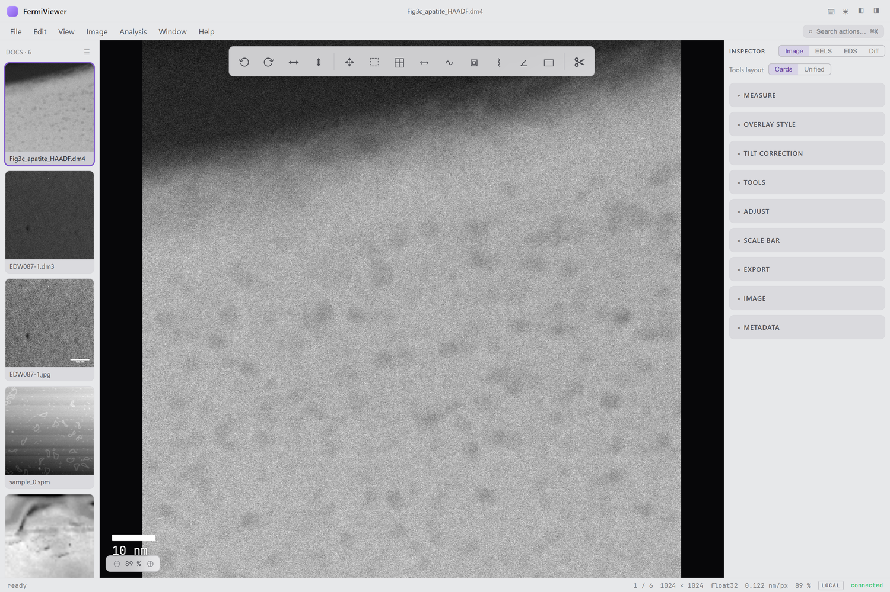
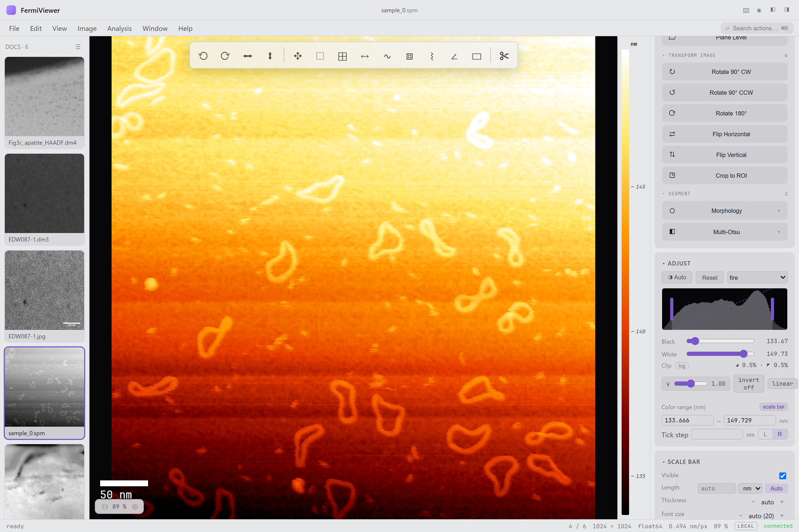
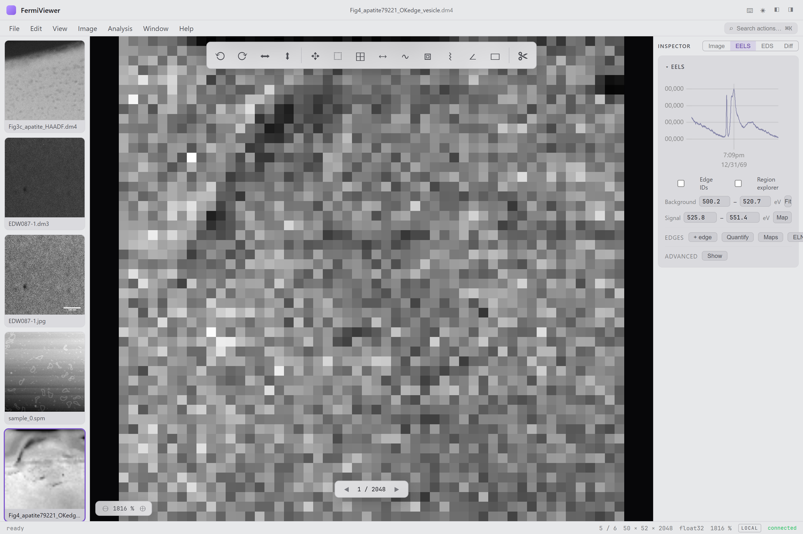

# fermiviewer

Electron-microscopy image analysis: TEM/STEM image viewing, EELS / EDS /
diffraction analysis, measurements, and image processing. Python (FastAPI)
backend + React frontend + Tauri desktop shell.

Ground-up port of [fermi-viewer](https://github.com/pquarterman17/fermi-viewer)
(MATLAB), and this is hte long term future of this style project. 



**Formats:** DM3 / DM4 (Gatan), BCF (Bruker), SER (TIA), MRC, TIFF,
PNG/JPEG, headerless RAW, plus Bruker Nanoscope AFM (`.spm` / `.000`).
**Analysis:** EELS (background, maps, quantification, thickness,
Kramers–Kronig, Fourier-log, SVD), EDS (Cliff–Lorimer / ZAF, composition
maps, composite overlays), diffraction (spot detection, phase indexing,
d-spacings), GPA strain, CTF estimation, atom columns, particles, grains,
FFT filtering, drift alignment, and a full measurement/annotation suite.

---

## Install

### Option 1 — Windows installer (recommended)

Grab `FermiViewer_x64-setup.exe` from the
[latest release](../../releases/latest) and run it. It is fully
self-contained (~47 MB) — **no Python, no Node, nothing else required**.
Launch *FermiViewer* from the Start menu; closing the window shuts
everything down.

> The installer is currently unsigned, so Windows SmartScreen may warn on
> first run — choose *More info → Run anyway*.

### Option 2 — standalone server (no installer)

Download `fv-server-win64.zip` from the same release, unzip anywhere, and
run:

```powershell
fv-server\fv-server.exe
```

This starts the full app at <http://127.0.0.1:8000> and opens your
browser. The server exits on its own when the last tab closes
(`--no-auto-shutdown` to keep it running, `--no-browser` to skip the
auto-open).

### Option 3 — from source

Requirements: [uv](https://docs.astral.sh/uv/) (a suitable Python is
fetched automatically) and Node 20+ for the frontend.

```bash
git clone https://github.com/pquarterman17/fermiviewer
cd fermiviewer

cd frontend && npm ci && npm run build && cd ..   # build the SPA once
uv sync                                           # install backend deps
uv run fv                                         # → http://127.0.0.1:8000
```

`uv run fv --desktop` opens a native window instead of the browser
(pywebview). For the Tauri shell / installer build, see *Packaging*
below.

> **OneDrive checkouts (Windows):** if the repo lives in a synced
> folder, move the venv out of OneDrive's reach before the first sync:
>
> ```powershell
> New-Item -ItemType Junction -Path .venv -Target "$env:LOCALAPPDATA\fermiviewer-venv"
> ```
>
> (`[tool.uv] link-mode = "copy"` is already set in `pyproject.toml`;
> the junction prevents sync-lock races during installs.)

---

## Usage

| Command | What it does |
|---|---|
| `uv run fv` | API + SPA on `:8000`, opens the browser, exits when the last tab closes |
| `uv run fv --desktop` | Native window (pywebview), exits on close |
| `uv run fv --dev` | Vite HMR (`:5173`) + auto-reloading backend, one terminal |
| `uv run fv --no-browser --no-auto-shutdown` | Plain server, stays up |

Open files via **File → Open…** (native picker), drag-and-drop, or
**File → Open by Path…** for large files already on the server's disk.
Press **?** in the app for the full keyboard map, **⌘K** for the command
palette.

---

## Documentation

Feature walkthroughs, screenshots, and how-tos live in the
**[project wiki](https://github.com/pquarterman17/fermiviewer/wiki)**:

- **[Getting Started](https://github.com/pquarterman17/fermiviewer/wiki/Getting-Started)** — install and your first image
- **[Viewing &amp; Display](https://github.com/pquarterman17/fermiviewer/wiki/Viewing-and-Display)** — colormaps, the calibrated color scale, scale bar
- **[Measurements](https://github.com/pquarterman17/fermiviewer/wiki/Measurements)** — line/box profiles, distances, ROIs, annotations
- **[Analysis Workshops](https://github.com/pquarterman17/fermiviewer/wiki/Analysis-Workshops)** — EELS, EDS, diffraction
- **[AFM Support](https://github.com/pquarterman17/fermiviewer/wiki/AFM-Support)** — Bruker Nanoscope height maps + Z-scale color bar
- **[Supported Formats](https://github.com/pquarterman17/fermiviewer/wiki/Supported-Formats)**

| Calibrated color scale (AFM height) | EELS analysis |
|---|---|
| [](https://github.com/pquarterman17/fermiviewer/wiki/AFM-Support) | [](https://github.com/pquarterman17/fermiviewer/wiki/Analysis-Workshops) |

---

## Development

```bash
uv sync --group dev                      # + ruff, mypy, pytest
uv run pytest                            # golden-verified; realdata tests
                                         #   auto-skip if the corpus is absent
uv run pytest -m "eels and golden"       # marker-scoped
uv run ruff check src tests
uv run mypy src

cd frontend
npm run dev                              # Vite on :5173, /api proxied
npx tsc --noEmit && npm run build
```

Hard rules (enforced by `tests/test_repo_integrity.py`):

- `io/` and `calc/` are pure libraries — they never import
  FastAPI/Pydantic; `routes/` are thin adapters.
- 500-line ceiling per source module.
- No GPL runtime dependencies (rosettasciio lives only in the `oracle`
  test group; PyInstaller only in the `bundle` build group).
- Physics constants port verbatim from the MATLAB reference — annotated
  do-not-"fix" items are calibrated/intentional.

---

## Packaging

A tagged push builds and publishes everything automatically
(`.github/workflows/release.yml`):

```bash
git tag v0.2.0 && git push origin v0.2.0
# → Release with FermiViewer_x64-setup.exe + fv-server-win64.zip
```

Local equivalents (Windows; needs Rust + VS Build Tools for the shell):

```bash
cd frontend && npm run build && cd ..
uv sync --group bundle
uv run pyinstaller tools/bundle/fv-server.spec --noconfirm --distpath dist-sidecar
cd src-tauri
npx @tauri-apps/cli@^2 build --config \
  '{"bundle":{"resources":{"../dist-sidecar/fv-server":"fv-server"}}}'
```

---

## Project docs

| Doc | Purpose |
|---|---|
| `docs/parity_report.md` | Three-way parity vs the MATLAB reference + design prototype |
| `docs/w3_imaging_audit.md` | Per-algorithm port decisions (map / port / hybrid) |
| `tests/golden/` | Frozen MATLAB reference values (see `tools/matlab/`) |
| `plans/` *(local-only)* | Per-machine working plans (gitignored, fermi-viewer convention) |

## License

Apache-2.0. Bundled JetBrains Mono is under the SIL OFL
(`frontend/public/fonts/OFL.txt`).
