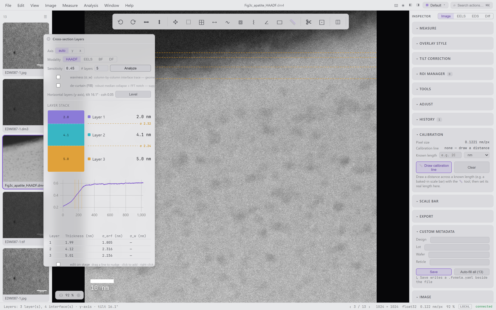
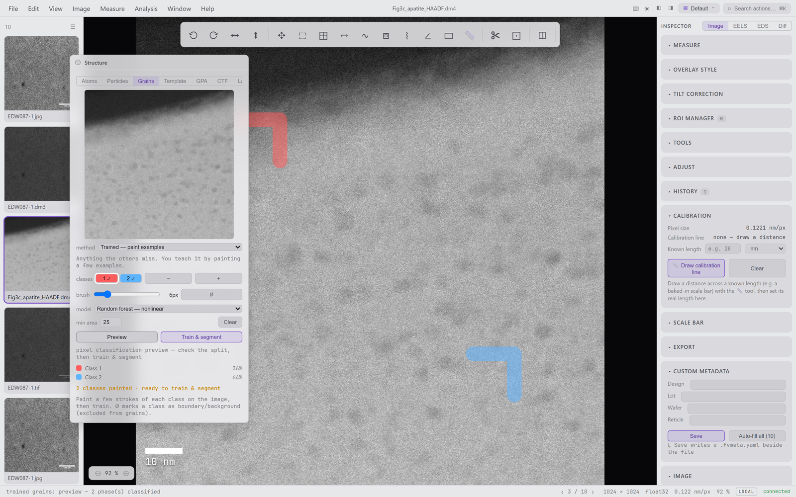

# fermiviewer

[](https://pypi.org/project/fermiviewer/)

Electron-microscopy image analysis: TEM/STEM image viewing, EELS / EDS /
diffraction analysis, measurements, and image processing. Python (FastAPI)
backend + React frontend + Tauri desktop shell.

Ground-up port of [fermi-viewer](https://github.com/pquarterman17/fermi-viewer)
(MATLAB), and the long-term home of this project line.


**Formats:** DM3 / DM4 (Gatan), BCF (Bruker), SER (TIA), MRC, TIFF,
PNG/JPEG, headerless RAW, plus Bruker Nanoscope AFM (`.spm` / `.000`).
**Analysis:** EELS (background, maps, quantification, thickness,
Kramers–Kronig, Fourier-log, SVD), EDS (Cliff–Lorimer / ZAF, composition
maps, composite overlays), diffraction (spot detection, phase indexing,
d-spacings), GPA strain, CTF estimation, atom columns, particles, grains
(k-means / watershed / paint-to-train classifier), cross-section layer &
interface-roughness analysis, FFT filtering, drift alignment, and a full
measurement/annotation suite.

---

## Install

### Option 1 — Windows installer (recommended)

Grab `FermiViewer_x64-setup.exe` from the
[latest release](../../releases/latest) and run it. It is fully
self-contained (~47 MB) — **no Python, no Node, nothing else required**.
Launch *FermiViewer* from the Start menu; closing the window shuts
everything down.

> The installer is currently unsigned, so Windows SmartScreen may warn on
> first run — choose *More info → Run anyway*.

### Option 2 — standalone server (no installer)

Download `fv-server-win64.zip` from the same release, unzip anywhere, and
run:

```powershell
fv-server\fv-server.exe
```

This starts the full app at <http://127.0.0.1:8000> and opens your
browser. The server exits on its own when the last tab closes
(`--no-auto-shutdown` to keep it running, `--no-browser` to skip the
auto-open).

### Option 3 — from source

Requirements: [uv](https://docs.astral.sh/uv/) (a suitable Python is
fetched automatically) and Node 20+ for the frontend. Get the code with
`git clone`, or download *Source code (zip)* from any
[release](../../releases/latest) and extract it — no git needed.

```bash
git clone https://github.com/pquarterman17/fermiviewer
cd fermiviewer

cd frontend && npm ci && npm run build && cd ..   # build the web UI (once)
uv sync                                           # install backend deps
uv run fv                                         # → http://127.0.0.1:8000
```

That is the whole build — after the first time, `uv run fv` is all you
run. `uv run fv --desktop` opens a native window instead of the browser
(pywebview). Building from source needs internet (PyPI + npm) — for a
machine without it, use the ready-made offline bundle in **Option 5**,
which skips Node and PyPI entirely. For the Tauri shell / installer
build, see *Packaging* below.

> **OneDrive checkouts (Windows):** if the repo lives in a synced
> folder, move the venv out of OneDrive's reach before the first sync:
>
> ```powershell
> New-Item -ItemType Junction -Path .venv -Target "$env:LOCALAPPDATA\fermiviewer-venv"
> ```
>
> (`[tool.uv] link-mode = "copy"` is already set in `pyproject.toml`;
> the junction prevents sync-lock races during installs.)

### Option 4 — install from PyPI (`pip` / `uv`)

FermiViewer is [on PyPI](https://pypi.org/project/fermiviewer/) with the
web UI already baked into the wheel — no Node, no checkout, no release
download; any 64-bit Python 3.10+ works. Install once, then launch from
any terminal — including from a folder of images:

```powershell
uv tool install fermiviewer              # exposes `fermiviewer` on PATH
fermiviewer                              # launch from anywhere
fermiviewer C:\data\session-42           # …or point it at a folder
```

`pip install fermiviewer` works too (same wheel; use pip if you don't
have uv). From a source checkout, the equivalent is
`uv tool install --from . fermiviewer`.

`fermiviewer` opens a browser tab once the server is confirmed up (no
more racing a cold start), and the in-app **Open** dialog defaults to the
folder you launched from. If a copy is already running it just opens a
new tab; if port 8000 is taken by another app it steps to the next free
port. `fv` remains as a short alias for the same entry point.

### Option 5 — air-gapped / offline machine (source install, no exe)

For machines with no internet access — or where IT policy rules out
running downloaded executables — each release ships per-OS
`fv-offline-*.zip` bundles: the FermiViewer wheel (web UI already baked
in) plus every dependency as pre-built wheels and a standard-library-only
installer. The only requirement on the target is a 64-bit Python 3.10+.

1. Download `fv-offline-win64.zip` (or `-macos-arm64` / `-linux-x64`)
   from the [latest release](../../releases/latest) and carry it over.
2. Extract anywhere writable and run `py install.py`
   (macOS/Linux: `python3 install.py`).
3. Launch with the generated `FermiViewer.bat` / `./fermiviewer`.

Everything lives in that one folder (nothing downloaded, no admin
rights); deleting the folder uninstalls it. Full details, including how
to review the exact pinned dependency versions, are in the bundle's
`README-OFFLINE.md`. To build a bundle yourself from a checkout (on a
connected machine of the same OS):

```bash
uv run python tools/offline/make_bundle.py
```

---

## Usage

| Command | What it does |
|---|---|
| `fermiviewer` / `fv` | API + SPA on `:8000`, opens the browser once healthy, exits when the last tab closes |
| `fermiviewer <dir>` | …and defaults the in-app Open dialog to `<dir>` |
| `fermiviewer --desktop` | Native window (pywebview), exits on close |
| `fermiviewer --dev` | Vite HMR (`:5173`) + auto-reloading backend, one terminal |
| `fermiviewer --no-browser --no-auto-shutdown` | Plain server, stays up |

Open files via **File → Open…** (the launch-folder list when started from
one, otherwise the native picker), drag-and-drop, or **File → Open by
Path…** for large files already on the server's disk. Press **?** in the
app for the full keyboard map, **⌘K** for the command palette.

---

## Documentation

Feature walkthroughs, screenshots, and how-tos live in the
**[project wiki](https://github.com/pquarterman17/fermiviewer/wiki)**:

- **[Getting Started](https://github.com/pquarterman17/fermiviewer/wiki/Getting-Started)** — install and your first image
- **[Viewing &amp; Display](https://github.com/pquarterman17/fermiviewer/wiki/Viewing-and-Display)** — colormaps, the calibrated color scale, scale bar
- **[Measurements](https://github.com/pquarterman17/fermiviewer/wiki/Measurements)** — line/box profiles, distances, ROIs, annotations
- **[Analysis Workshops](https://github.com/pquarterman17/fermiviewer/wiki/Analysis-Workshops)** — EELS, EDS, diffraction
- **[Structure &amp; Grains](https://github.com/pquarterman17/fermiviewer/wiki/Structure-and-Grains)** — grain segmentation (incl. paint-to-train), cross-section layer &amp; interface-roughness analysis
- **[AFM Support](https://github.com/pquarterman17/fermiviewer/wiki/AFM-Support)** — Bruker Nanoscope height maps + Z-scale color bar
- **[Supported Formats](https://github.com/pquarterman17/fermiviewer/wiki/Supported-Formats)**

| Cross-section layer stack | Trained grain classifier |
|---|---|
| [](https://github.com/pquarterman17/fermiviewer/wiki/Structure-and-Grains) | [](https://github.com/pquarterman17/fermiviewer/wiki/Structure-and-Grains) |

| Calibrated color scale (AFM height) | EELS analysis |
|---|---|
| [](https://github.com/pquarterman17/fermiviewer/wiki/AFM-Support) | [](https://github.com/pquarterman17/fermiviewer/wiki/Analysis-Workshops) |

---

## Development

```bash
uv sync --group dev                      # + ruff, mypy, pytest
uv run pytest                            # golden-verified; realdata tests
                                         #   auto-skip if the corpus is absent
uv run pytest -m "eels and golden"       # marker-scoped
uv run ruff check src tests
uv run mypy src

cd frontend
npm run dev                              # Vite on :5173, /api proxied
npx tsc --noEmit && npm run build
```

Hard rules (enforced by `tests/test_repo_integrity.py`):

- `io/` and `calc/` are pure libraries — they never import
  FastAPI/Pydantic; `routes/` are thin adapters.
- 500-line ceiling per source module.
- No GPL runtime dependencies (rosettasciio lives only in the `oracle`
  test group; PyInstaller only in the `bundle` build group).
- Physics constants port verbatim from the MATLAB reference — annotated
  do-not-"fix" items are calibrated/intentional.

---

## Packaging

A tagged push builds and publishes everything automatically
(`.github/workflows/release.yml`):

```bash
git tag v0.2.0 && git push origin v0.2.0
# → Release with the per-OS installers (.exe / .dmg / .deb), the
#   fv-server-* standalone archives, the fv-offline-* air-gapped
#   bundles, and the auto-updater's latest.json
# → PyPI wheel (SPA baked in), published via trusted publishing after
#   a clean-venv install + boot smoke test
```

Local equivalents (Windows; needs Rust + VS Build Tools for the shell):

```bash
cd frontend && npm run build && cd ..
uv sync --group bundle
uv run pyinstaller tools/bundle/fv-server.spec --noconfirm --distpath dist-sidecar
cd src-tauri
npx @tauri-apps/cli@^2 build --config \
  '{"bundle":{"resources":{"../dist-sidecar/fv-server":"fv-server"}}}'
```

> The desktop shell shows a loading splash and only navigates to the app
> once `/api/health` answers, so a slow first start no longer lands on a
> "can't reach this page" error. This lives in the Rust shell — installed
> copies must be **rebuilt and reinstalled** to pick it up (rebuild the
> SPA first so `frontend/dist/loading.html` is bundled).

---

## Project docs

| Doc | Purpose |
|---|---|
| `docs/parity_report.md` | Three-way parity vs the MATLAB reference + design prototype |
| `docs/w3_imaging_audit.md` | Per-algorithm port decisions (map / port / hybrid) |
| `tests/golden/` | Frozen MATLAB reference values (see `tools/matlab/`) |
| `plans/` *(local-only)* | Per-machine working plans (gitignored, fermi-viewer convention) |

## License

Apache-2.0. Bundled JetBrains Mono is under the SIL OFL
(`frontend/public/fonts/OFL.txt`).
