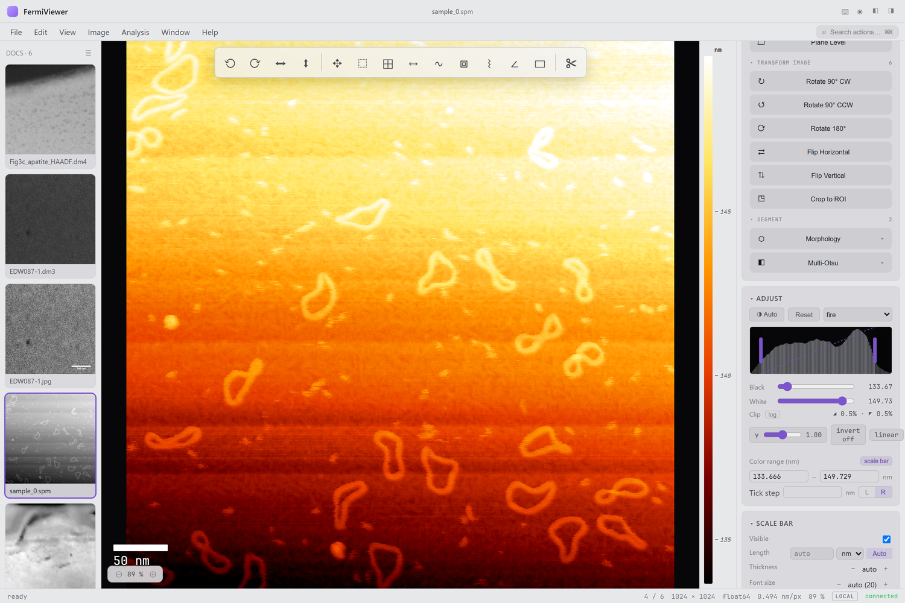
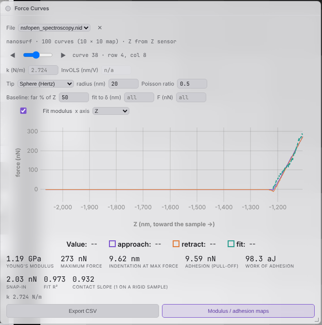

# AFM Support

FermiViewer opens atomic force microscopy (and other scanning-probe) data
as calibrated height images, so every viewing, measurement and export tool
works on them. SPM-specific tools live in **Analysis ▸ AFM / SPM**.



## Formats

| Vendor | Files | Notes |
|---|---|---|
| Bruker NanoScope | `.spm`, `.000`–`.nnn` | images and force curves |
| Gwyddion | `.gwy` (incl. Gwyddion 1.x), `.gsf` | anything exported to Gwyddion opens too |
| Asylum Research | `.ibw` | images and force curves |
| JPK | `.jpk`, `.jpk-qi-image` | |
| WSxM | `.top`, `.stp`, … | any WSxM channel file, recognised by content |
| Nanosurf | `.nid` | images, force curves and force maps |
| NT-MDT | `.mdt` | |
| Nanonis | `.sxm` | |

Lengths are converted to nm, and the pixel value is the physical
quantity (height in nm, phase in °, current in A …). The
height channel opens first. **AFM / SPM ▸ Open Other Channels** brings in the
rest of the scan: phase, amplitude, adhesion, modulus …, trace and retrace.

## Levelling and repair

Levelling is usually the first step, and every result is a new image
with Undo:

| Menu item | What it does |
|---|---|
| **Plane Level…** | Subtracts a fitted plane or polynomial (order 1–3). With *fit percentile* < 100, only the lowest pixels are fitted, so particles do not tilt the result. |
| **Level Rows…** | Corrects each scan line: *median*, *mean*, *median of differences* (aligns each line to the previous one, robust to features crossing it), or a per-line polynomial. |
| **Remove Scars…** | Finds 1–N-line streaks where the feedback jumped and fills them from the lines around them. |
| **Three-Point Level** | Uses the plane through three points you click. Draw them with the Angle tool or as a 3-vertex polygon first. |
| **Fix Zero…** | Shifts heights so the minimum, mean or median is zero. |

The same corrections are in the Tools panel's **Level & Correct** group,
and as ops for scripts and batch (see below).

## Surface Analysis (ISO 25178)

**AFM / SPM ▸ Surface Analysis (ISO 25178)…** reports areal texture
parameters for the whole image or the selected region, after optional
plane or quadratic levelling:

| Family | Parameters |
|---|---|
| Height | Sa, Sq, Ssk, Sku, Sp, Sv, Sz |
| Hybrid | Sdq (rms gradient), Sdr (developed area ratio) |
| Spatial | Sal (autocorrelation length), Str (texture aspect ratio), Std (texture direction) |
| Functional | Sk, Spk, Svk, Smr1, Smr2 (core / peak / valley from the material-ratio curve); Vmp, Vmc, Vvc, Vvv (material and void volumes at 10 % and 80 %) |

The workshop also plots the radial power spectrum and the height and
slope distributions, and exports everything to CSV or JSON. Sdq, Sdr and
the slopes need heights and pixel size in length units.

Other surface tools in the menu:

- **2-D Power Spectrum Map** / **Autocorrelation Map** — the PSD (log10)
  or ACF of the height map as a new image, with frequency or lag axes.
- **Step Height** — draw a rectangle across a step edge. It reports the
  height difference between the two terraces and the roughness of each.
- **Particles… / Grains…** — on a height map, the tables gain each
  region's maximum height, height above its base and volume.
- **Surface Roughness**, **3-D Surface** — the general workshops, which also
  work on AFM data.

## Force curves

Force-curve files open with **File ▸ Open** like any other file: Bruker
force files, Asylum `.ibw` force curves and Nanosurf spectroscopy. They
appear in the **Force Curves** workshop, also at **AFM / SPM ▸ Force
Curves…**. A Nanosurf force map also opens its topography image.



For each curve, the workshop:

1. **Subtracts a baseline.** A straight line is fitted over the far part
   of the approach (the first 50 % of its Z range by default). This removes
   the deflection offset and any tilt.
2. **Finds the contact point**, where the approach leaves the baseline.
3. **Fits a contact model** for the modulus, with the contact point as a
   free parameter. You can limit the fit to a maximum indentation or force.

   | Tip | Model |
   |---|---|
   | Sphere | Hertz: F = 4/3 · E/(1−ν²) · √R · δ^3/2 |
   | Cone | Sneddon: F = 2/π · E/(1−ν²) · tan α · δ² |
   | Pyramid | Bilodeau: F = 0.7453 · E/(1−ν²) · tan α · δ² |
   | Flat punch | F = 2 · E/(1−ν²) · R · δ |

4. **Measures adhesion** on the retract curve: the pull-off force and
   the work of adhesion (aJ). It also reports the snap-in on approach, the
   maximum force and indentation, and the fit quality.

Plot the curves against **Z** or against **tip–sample separation**.

**Calibration.** The spring constant and InvOLS (deflection sensitivity)
come from the file; type new values to override them.

- On a **rigid sample** (sapphire, silicon), the *contact slope* should be 1.
- If it is not, the InvOLS is off. The workshop offers **Use InvOLS …**
  with the value that corrects it.
- Nanosurf files store deflection already as force, so there is no InvOLS
  to change.

**Force maps.** **Modulus / adhesion maps** analyses every curve. It adds
Young's modulus, adhesion and contact-height images to the library,
calibrated to the map's grid. Large maps run on all CPU cores.

A list of curves that is not a map gives a per-curve CSV instead.

## Scripting and batch

Levelling and surface analysis are ops, so they run from Python, `fv
--script` and batch recipes exactly as in the GUI:

```python
import fermiviewer.api as fv

scan = fv.open("sample.spm")
flat = scan.plane_level(order=1).image.row_level(method="mdiff").image
texture = flat.surface_texture(level="none").value
print(texture["Sa"], texture["Sk"], texture["unit"])
psd = flat.surface_map(kind="psd").image          # 2-D PSD as an image
```

| Op | Purpose |
|---|---|
| `plane_level`, `row_level`, `scar_removal`, `zero_level` | levelling and repair |
| `surface_texture` | ISO 25178 parameters |
| `surface_map` | 2-D PSD / ACF image |
| `step_height` | step between two terraces (crop to the step first) |

Force-curve analysis is not an op yet: force files are not images. Use the
workshop for it.

Next: the wiki's [Supported Formats](https://github.com/pquarterman17/fermiviewer/wiki/Supported-Formats) page.
